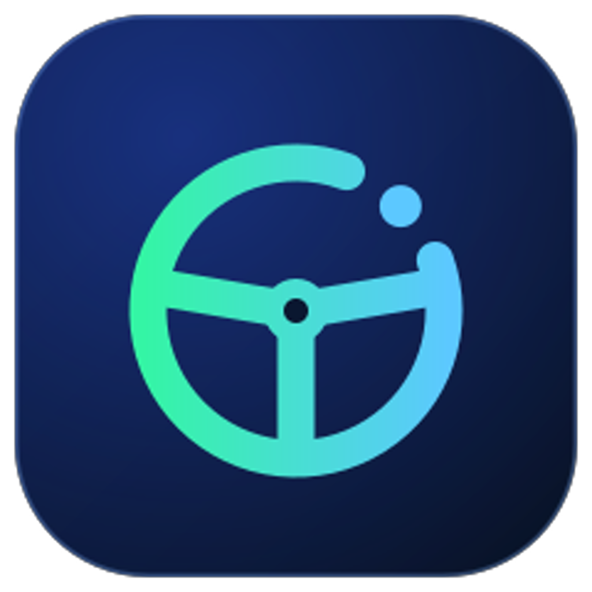

# Backseat



**Backseat-drive your Cline coding agent from your phone.**

Chat with Muse anywhere — your PC does the coding. You architect from the
couch; Cline builds in VS Code. No servers, no open ports, no shared API
keys. GitHub is the only wire.

```
you (phone) ──chat──▶ Muse (architect) ──git──▶ Backseat extension ──▶ Cline (builder)
   "add a login page"      queues tasks          runs them on your PC     in VS Code
```

## Instant setup

**1. Create your private copy.**
Click **Use this template** at the top of this page and create a **private**
repository. That's your personal bridge — your tasks and project paths stay
visible only to you.

**2. Give your Muse access to the repo.**
Your Muse needs to read and write that private repo. Paste the repo link
into Muse and say *"set up Backseat with this repo"* — it reads `MUSE.md`,
installs the GitHub CLI if needed, and walks you through a 30-second
sign-in: it shows you a short code, you type it into **github.com/device**
on your phone, done. No tokens to create, no permissions to pick.
Its side is fully automatic from there.

Then tell your Muse two things:
- *"Check the bridge repo every 10 minutes and tell me when tasks finish."*
- *"Every morning at 7, summarize last night's work into a digest."*

**3. Install the VS Code plugin and connect it — two minutes, no settings JSON.**
Download [`dist/backseat-latest.vsix`](dist/backseat-latest.vsix), then in
VS Code: Extensions → `…` → *Install from VSIX*. Requires the Cline extension
(signed in — your model key never leaves your PC) and Git.

Then open the **Backseat** tab in the activity bar (the steering-wheel
icon):
- Type your private repo (`darek225/backseat-bridge`) and an unguessable
  ping topic (e.g. `backseat-9f3k7q2x`) into the setup card, then hit
  **Save & connect**. The extension clones the repo into
  `~/.backseat/bridge` and manages it itself — it works in *every* VS Code
  window, whatever project you have open. The ping topic is
  machine-to-machine signaling only (no app, no account, nothing to
  install): your Muse's ping wakes the PC in ~1 second when you queue a
  task, and the PC pings back the moment a task finishes.
- If the clone needs your GitHub sign-in, you'll get a one-click
  **Run clone in terminal** button — sign in there, done.
- Hit **Run setup doctor**: every check should read PASS. If something's
  red, the message tells you exactly what's missing.

Now chat with Muse: `status` to see what's happening, `queue: <description>`
to send Cline work. You can also manage projects by texting:
`open my blog`, `create a new project called X`, `close vscode`.
Hand Muse a big plan in the evening and it will break it into tasks,
work the queue overnight, and leave a digest in the morning.

## How your Muse finds your Cline (and nobody else's)

There's no account system and no central server. The pairing **is** your
private repo copy:

- Only **your** Muse knows your repo — you gave it the link.
- Only **your** PC has that repo cloned with your Git credentials.
- Only **your** VS Code runs the Backseat extension against that clone.

Nobody else's Muse can see your repo, so nobody else's tasks can reach your
PC. One private copy per person keeps every bridge separate by construction.

## How it works

- **Muse** breaks your requests into tasks: `tasks/pending/<id>.json`
  (prompt, project dir, timeout — see `protocol.md`).
- **The Backseat extension** polls the repo, claims the oldest task
  (the git push is the lock), and hands the prompt to Cline — via Cline's
  extension API when available, falling back to the headless `cline --yolo`
  CLI. Live progress lands in `tasks/status/<id>.json`.
- **Finished tasks** move to `tasks/done/` with the result; Muse reports
  back in chat like a human would.

One task at a time. Heartbeats every ~30s while running. With
`backseat.notifyTopic` set, task pickup is ~instant (ntfy wake-up ping) and
completions ping back immediately; without it, the extension polls every
`pollIntervalSec` (default 30s). Muse's checks are polling (every few
minutes), so asking `status` in chat is the fast path.

## Security

- **Auto-approve is the point — and the risk.** Cline runs unsupervised, so
  only queue work you'd let run on its own, pointed at project directories.
- **No secrets in the repo.** Tasks carry prompts and paths only. API keys
  stay in Cline's own config on the PC.
- **Private repo recommended.**

## Honest limitations

- **Your PC must stay on and awake**, with VS Code open on the bridge repo
  folder. Asleep means silent — queued tasks just wait.
- **Muse's side is polling, not instant.** It checks every few minutes; ask
  `status` in chat for the fast path.
- **The Cline extension API is unverified** — Backseat probes it and falls
  back to the documented headless `cline --yolo` CLI, which is the tested path.
- **One PC per bridge repo.** Two PCs racing the same queue is undefined behavior.
- **Don't add collaborators you don't fully trust** — anyone with write
  access can queue tasks that run code on your PC.

## Files

- `MUSE.md` — setup brief: send the repo to any Muse and it configures itself
- `protocol.md` — exact JSON schemas for tasks and status files
- `CHANGELOG.md` — what's new in each release
- `vscode-bridge/` — the VS Code extension source (TypeScript)
- `dist/backseat-latest.vsix` — packaged plugin, ready to install
