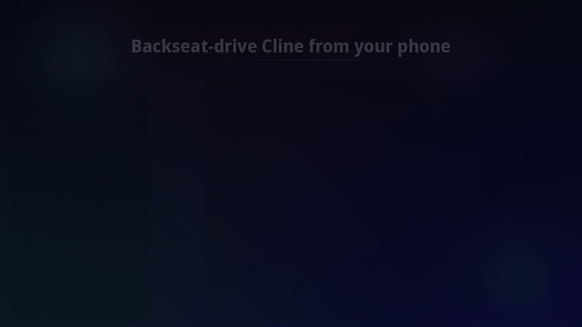

# Backseat

**Backseat-drive your Cline coding agent from your phone.**



Chat with Muse anywhere — your PC does the coding. You architect from the
couch; Cline builds in VS Code. No servers, no open ports, no shared API
keys. GitHub is the only wire.

```text
you (phone) ──chat──▶ Muse (architect) ──git──▶ Backseat extension ──▶ Cline (builder)
   "add a login page"      queues tasks          runs them on your PC     in VS Code
```

## What it does

Backseat turns a private GitHub repo into a task queue between you, Muse,
and Cline:

- You describe work in plain language from your phone.
- Muse writes it up as a task in your private bridge repo.
- This VS Code extension picks the task up and runs it in Cline's sidebar,
  visibly, with your existing Cline provider/model settings.
- Status, heartbeats, failures, and finished summaries flow back through the
  repo so Muse can report like a human would.

The unglamorous parts are the point: provider-error auto-retries, session
re-adoption after VS Code restarts, remote cancel from your phone, and a
setup doctor that tells you exactly which link in the chain is broken.

## Setup

1. Create your private copy of the bridge template:
   <https://github.com/darek225/backseat> → **Use this template** → private repo.
2. Paste your new repo link into Muse and say: **"set up Backseat with this repo."**
   Muse reads `MUSE.md`, clones your copy, and starts watching for work.
3. Install this extension, install/sign in to Cline, and open the **Backseat**
   tab in the VS Code activity bar.
4. Put your private repo (`owner/repo`) and an unguessable ping topic in the
   setup card, hit **Save & connect**, then run **Backseat: Run setup doctor**.

No settings JSON spelunking. No terminal window babysitting.

## Commands

- `Backseat: Start polling`
- `Backseat: Stop polling`
- `Backseat: Check for tasks now`
- `Backseat: Show status`
- `Backseat: Run setup doctor`

## How it drives Cline

Preferred path: Backseat activates the Cline extension
(`saoudrizwan.claude-dev`) and starts the task in Cline's sidebar via
`startNewTask`, so you can watch the work happen at chat speed.

Fallback path: if the extension API shape is not available, Backseat uses the
documented headless Cline CLI (`cline --yolo`) in the task's project
directory. Once a task starts on one path, Backseat stays on that path — it
never runs the same prompt twice.

## Security model

- **Auto-approve is the point — and the risk.** Only queue work you would let
  run unsupervised, pointed at project directories you trust.
- **No secrets in the repo.** Tasks carry prompts and paths only. Your model
  keys stay in Cline's own config on your PC.
- **No open ports.** The extension only makes outbound git calls to GitHub.
- **Private repo = pairing.** Only your Muse knows the repo, only your PC
  has it cloned with your credentials, and only your VS Code runs Backseat
  against it.

## Limitations

- Your PC must be on and awake with VS Code open. Asleep means queued tasks wait.
- One task at a time per PC.
- Do not add collaborators you do not fully trust: anyone with write access
  to the bridge repo can queue tasks that run code on your PC.

## Support

Issues and source: <https://github.com/darek225/backseat>

MIT licensed.
